# Active Directory Home Lab

A complete home lab setup of Windows Server 2022 Active Directory Domain Services (AD DS) running in VirtualBox on a Windows 11 host. This lab covers domain controller promotion, OU structure, user and group management, Group Policy, client domain join, and network drive mapping.

---

## Table of Contents

- [Lab Environment](#lab-environment)
- [Network Topology](#network-topology)
- [Phase 1 — Domain Controller Setup](#phase-1--domain-controller-setup)
- [Phase 2 — Active Directory Structure](#phase-2--active-directory-structure)
- [Phase 3 — Client VM Setup and Domain Join](#phase-3--client-vm-setup-and-domain-join)
- [Phase 4 — Group Policy](#phase-4--group-policy)
- [Key Commands Reference](#key-commands-reference)
- [Skills Demonstrated](#skills-demonstrated)

---

## Lab Environment

| Component | Details |
|---|---|
| Host OS | Windows 11 Pro (Build 26200 / 25H2) |
| Hypervisor | Oracle VirtualBox |
| Domain Controller | Windows Server 2022 Standard Evaluation |
| Client Machine | Windows 11 Enterprise Evaluation |
| Domain Name | `lab.local` |
| NetBIOS Name | `LAB` |
| DC Hostname | `DC1` |
| Client Hostname | `Client1` |

### Storage Layout

```
D:\AD-Lab\
  ├── ISOs\
  │     ├── SERVER_EVAL_x64FRE_en-us.iso
  │     └── 26200.6584.250915-1905.25h2_ge_release.iso
  └── VMs\
        ├── DC1\
        │     └── DC1_2.vdi  (50GB)
        └── Client1\
              └── Client1.vdi  (80GB)
```

---

## Network Topology

```
┌─────────────────────────────────────────┐
│         VirtualBox Internal Network     │
│              (adlab-net)                │
│                                         │
│   ┌─────────────┐    ┌──────────────┐  │
│   │    DC1      │    │   Client1    │  │
│   │ 192.168.10.1│◄──►│192.168.10.2  │  │
│   │  lab.local  │    │  lab.local   │  │
│   │  DNS: self  │    │DNS:192.168.  │  │
│   │             │    │    10.1      │  │
│   └─────────────┘    └──────────────┘  │
└─────────────────────────────────────────┘
```

Both VMs are on an **isolated Internal Network** — no internet access, no home network exposure. Fully self-contained lab.

---

## Phase 1 — Domain Controller Setup

### Step 1: Install AD DS Role

After installing Windows Server 2022 and setting a static IP, the Active Directory Domain Services role was installed via PowerShell:

```powershell
Install-WindowsFeature AD-Domain-Services -IncludeManagementTools
```

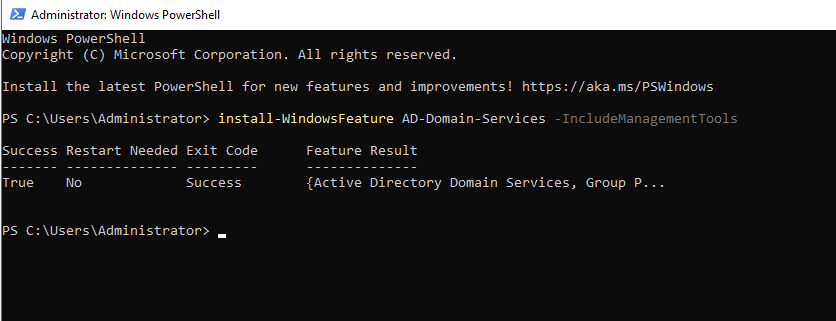

Result: `Success: True` — no restart required at this stage.

---

### Step 2: Promote to Domain Controller

```powershell
Install-ADDSForest -DomainName "lab.local"
```

This command:
- Created a new forest (`lab.local`)
- Promoted the server to the first Domain Controller
- Installed DNS Server role automatically
- Required a DSRM (Directory Services Restore Mode) password
- Triggered an automatic restart upon completion

After restart, the login screen changed from local machine login to `LAB\Administrator` — confirming successful domain promotion.

---

### Step 3: Verify Domain

```powershell
Get-ADDomain
```

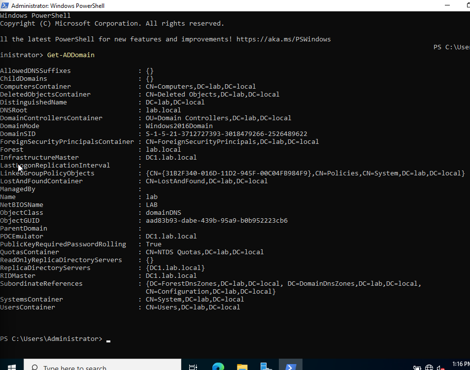

Key details confirmed:
- Domain: `lab.local`
- NetBIOS: `LAB`
- Forest: `lab.local`
- DC1 holds all 5 FSMO roles (normal for a single-DC lab)
- Domain Functional Level: Windows 2016

---

### Network Configuration

| Setting | DC1 | Client1 |
|---|---|---|
| IP Address | 192.168.10.1 | 192.168.10.2 |
| Subnet Mask | 255.255.255.0 | 255.255.255.0 |
| Default Gateway | *(blank)* | 192.168.10.1 |
| DNS Server | 127.0.0.1 | 192.168.10.1 |
| Network Adapter | Internal Network (adlab-net) | Internal Network (adlab-net) |

> DNS on DC1 points to itself (`127.0.0.1`) because once promoted, DC1 becomes its own DNS authority for `lab.local`. Client1 points to DC1 (`192.168.10.1`) for all name resolution.

---

## Phase 2 — Active Directory Structure

### Step 4: Organizational Units (OUs)

Created 5 OUs to mirror a real company department structure:

```
lab.local
  ├── IT
  ├── Sales
  ├── HR
  ├── Servers
  └── Workstations
```

Created via Active Directory Users and Computers (`dsa.msc`):
Right-click `lab.local` → New → Organizational Unit

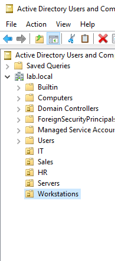

---

### Step 5: Users

Created domain users in their respective OUs:

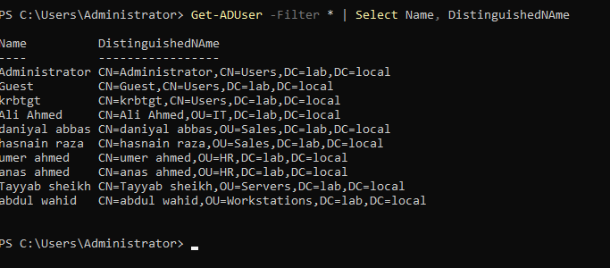

| Full Name | OU | Purpose |
|---|---|---|
| Ali Ahmed | IT | IT department user (used for domain join testing) |
| daniyal abbas | Sales | Sales department user |
| hasnain raza | Sales | Sales department user |
| umer ahmed | HR | HR department user |
| anas ahmed | HR | HR department user |
| Tayyab sheikh | Servers | Server admin user |
| abdul wahid | Workstations | Workstation user |

**IT OU:**

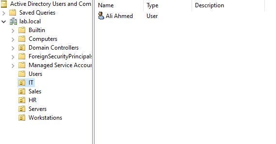

**Sales OU:**

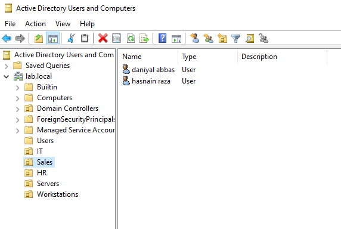

**HR OU:**

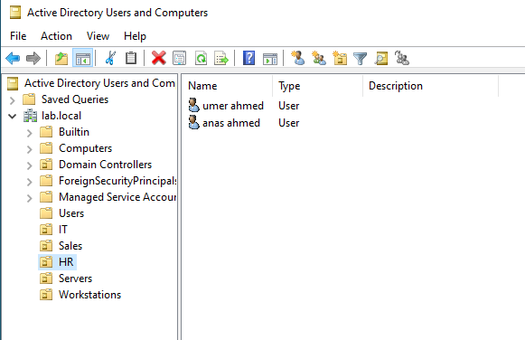

**Servers OU:**

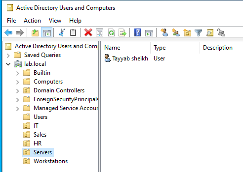

**Workstations OU:**

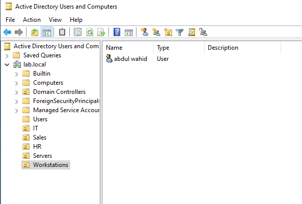

---

### Step 6: Security Groups

Created one Security Group per department, all scoped as Global Security groups:

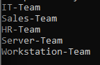

| Group Name | Scope | Type | OU |
|---|---|---|---|
| IT-Team | Global | Security | IT |
| Sales-Team | Global | Security | Sales |
| HR-Team | Global | Security | HR |
| Server-Team | Global | Security | Servers |
| Workstation-Team | Global | Security | Workstations |

Users were added to their department groups via:
User Properties → Member Of → Add

> In real AD environments, permissions are always assigned to **groups**, never to individual users. This makes access management scalable — adding or removing a user from a group instantly grants or revokes all associated permissions.

---

## Phase 3 — Client VM Setup and Domain Join

### Step 7: Windows 11 Client Setup

Installed Windows 11 Enterprise Evaluation on Client1 VM with:
- 2 vCPU, 2GB RAM, 80GB dynamic disk
- Network: Internal Network → `adlab-net`

**TPM/Secure Boot bypass** was required since EFI was disabled for boot compatibility. Applied via registry during setup (Shift+F10):

```
HKEY_LOCAL_MACHINE\SYSTEM\Setup\LabConfig
  BypassTPMCheck       = 1
  BypassSecureBootCheck = 1
  BypassRAMCheck        = 1
```

> Microsoft named this key "LabConfig" — it's a built-in mechanism designed exactly for lab and VM scenarios.

---

### Step 8: Join Client1 to Domain

Before joining, set Client1's static IP and pointed DNS to DC1:

```
IP:      192.168.10.2
Subnet:  255.255.255.0
Gateway: 192.168.10.1
DNS:     192.168.10.1
```

Verified connectivity:
```cmd
ping 192.168.10.1
```
Result: 4 sent, 4 received ✅

Domain join via:
- Right-click Start → System → Rename this PC (Advanced) → Change → Domain → `lab.local`
- Credentials: `LAB\Administrator`

Result: **"Welcome to the lab.local domain"** — restart prompted and completed.

---

### Step 9: Domain User Login

After Client1 joined the domain, logged in as domain user `LAB\ali` (Ali Ahmed from IT OU):

The login proved the full AD authentication chain:
1. Client1 asks DC1: "Is this user valid?"
2. DC1 checks its database and confirms credentials
3. Client1 grants access based on DC1's response

---

## Phase 4 — Group Policy

### Step 10: Password Policy GPO

Edited the **Default Domain Policy** via Group Policy Management (`gpmc.msc`):

```
Computer Configuration
  → Policies
    → Windows Settings
      → Security Settings
        → Account Policies
          → Password Policy
```

| Setting | Value |
|---|---|
| Minimum password length | 8 characters |
| Password complexity | Enabled |
| Maximum password age | 90 days |
| Minimum password age | 1 day |
| Enforce password history | 5 passwords remembered |

**Verification on Client1:**

```cmd
gpresult /r
```

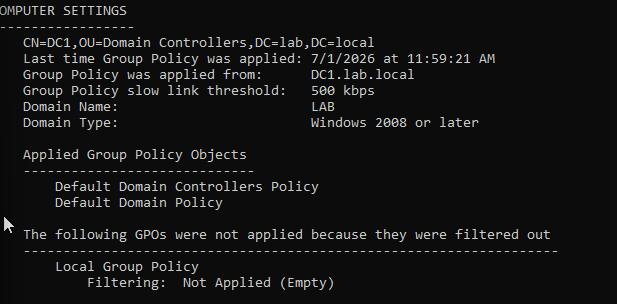

Confirmed:
- Group Policy applied from: `DC1.lab.local`
- Default Domain Policy: Applied ✅
- Default Domain Controllers Policy: Applied ✅

---

### Step 11: Network Drive Mapping GPO

Created a new GPO named **"Map SharedDrive"** linked to `lab.local`.

**Created shared folder on DC1:**
- Path: `C:\SharedDrive`
- Share name: `SharedDrive`
- Share permissions: Everyone → Read
- NTFS permissions: Domain Users → Read & Execute

**GPO Drive Map configured via:**
```
User Configuration
  → Preferences
    → Windows Settings
      → Drive Maps
```

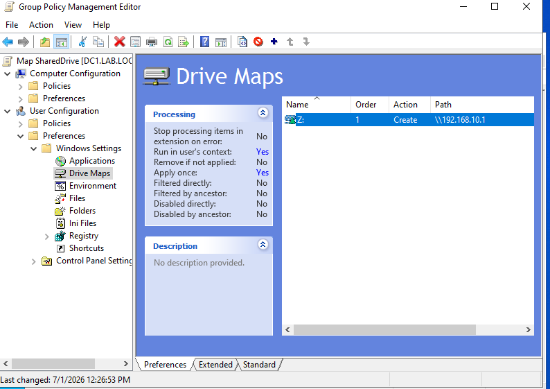

| Setting | Value |
|---|---|
| Action | Create |
| Location | `\\192.168.10.1\SharedDrive` |
| Drive Letter | Z: |
| Reconnect | Yes |
| Run in user context | Yes |

**Verified GPO reaching Client1:**

```cmd
gpresult /r
```

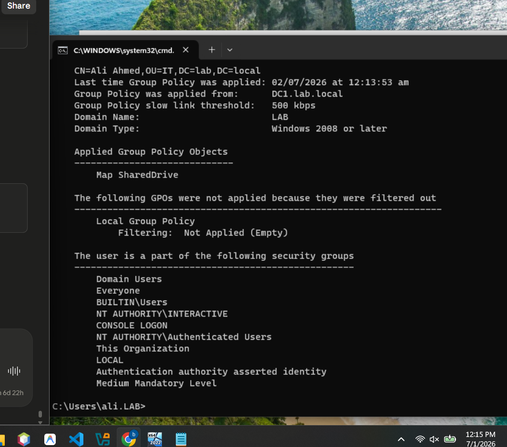

Confirmed:
- GPO applied from: `DC1.lab.local`
- **Map SharedDrive: Applied** ✅
- Ali Ahmed confirmed as `CN=Ali Ahmed,OU=IT,DC=lab,DC=local`

**Verified shares on DC1:**

```powershell
Get-SmbShare
```

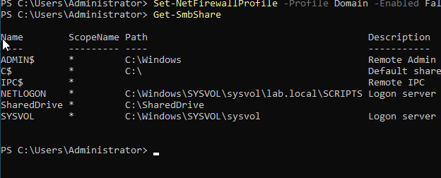

NETLOGON, SYSVOL, and SharedDrive all confirmed active.

**Verified network access from Client1:**

```cmd
net view \\192.168.10.1
```

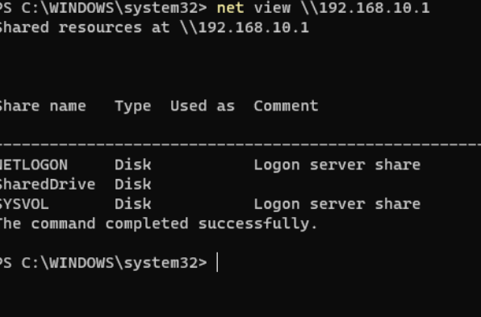

All three shares visible: NETLOGON, SharedDrive, SYSVOL ✅

**Final result — Z: drive mapped on Client1:**

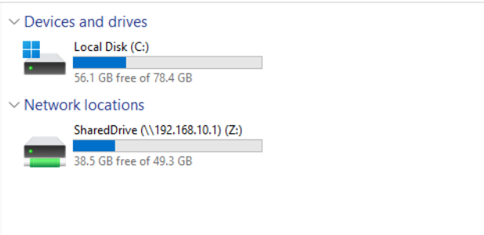

`SharedDrive (\\192.168.10.1) (Z:)` visible under Network Locations in File Explorer ✅

---

## Key Commands Reference

```powershell
# Install AD DS role
Install-WindowsFeature AD-Domain-Services -IncludeManagementTools

# Promote server to Domain Controller
Install-ADDSForest -DomainName "lab.local"

# Verify domain
Get-ADDomain

# List all users with OU location
Get-ADUser -Filter * | Select Name, DistinguishedName

# List all groups
Get-ADGroup -Filter * | Select Name

# Create an OU
New-ADOrganizationalUnit -Name "IT" -Path "DC=lab,DC=local"

# Create a user
New-ADUser -Name "John Smith" -SamAccountName "jsmith" -Path "OU=IT,DC=lab,DC=local" -AccountPassword (ConvertTo-SecureString "Password1!" -AsPlainText -Force) -Enabled $true

# Add user to group
Add-ADGroupMember -Identity "IT-Team" -Members "jsmith"

# Force Group Policy update
gpupdate /force

# Check applied GPOs
gpresult /r

# Check DC health
dcdiag

# List SMB shares
Get-SmbShare

# Check network profile
Get-NetConnectionProfile

# Map network drive manually
net use Z: \\192.168.10.1\SharedDrive /persistent:yes
```

---

## Skills Demonstrated

| Skill | Details |
|---|---|
| Hypervisor setup | VirtualBox with Internal Network isolation |
| Windows Server 2022 | Installation, configuration, role management |
| AD DS | Forest/domain creation, DC promotion |
| DNS | DC as authoritative DNS for lab.local |
| Static IP configuration | DC and client IP planning |
| OU design | Department-based OU hierarchy |
| User management | Domain user creation and OU placement |
| Group management | Global Security groups, user membership |
| Domain join | Client machine joined to lab.local |
| AD authentication | Domain user login on client machine |
| Group Policy | Password policy, drive mapping GPO |
| SMB shares | Creating and securing network shares |
| PowerShell | AD cmdlets, firewall, network configuration |
| Troubleshooting | SMB signing, network profiles, GPO debugging |

---

## Snapshots Taken

| Snapshot | VM | State |
|---|---|---|
| DC1 - Clean Domain Controller | DC1 | After domain promotion, IP set, OUs and users created |
| Client1 - Clean Domain Join | Client1 | After Windows 11 install and domain join |

---

## Next Steps

- [ ] Delegation of Control (Help Desk password reset permissions)
- [ ] Fine-Grained Password Policies (different rules per group)
- [ ] Folder Redirection via GPO
- [ ] Restrict Control Panel access for standard users via GPO
- [ ] Second Domain Controller (DC2) for redundancy practice
- [ ] DHCP Server role configuration
- [ ] AD Recycle Bin and object recovery practice
- [ ] `dcdiag` and `repadmin` health check practice
